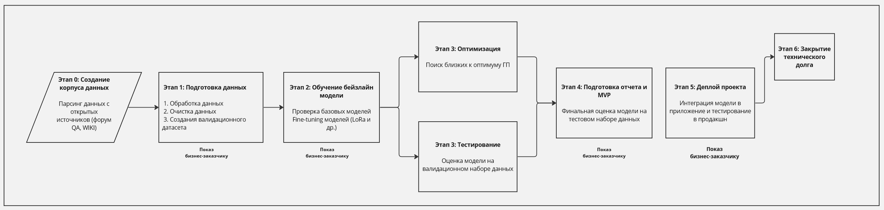
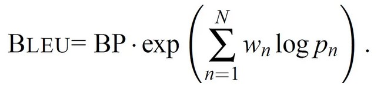
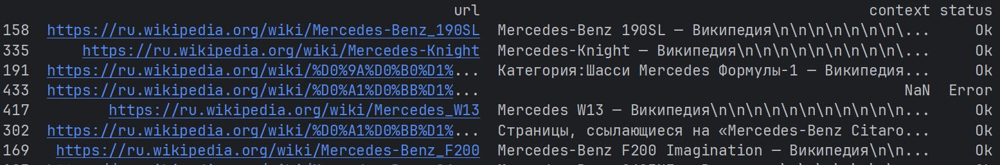
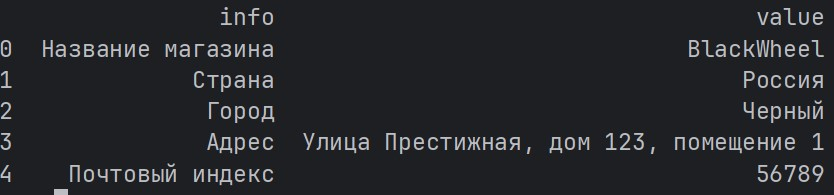
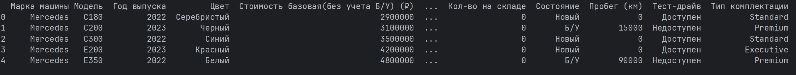
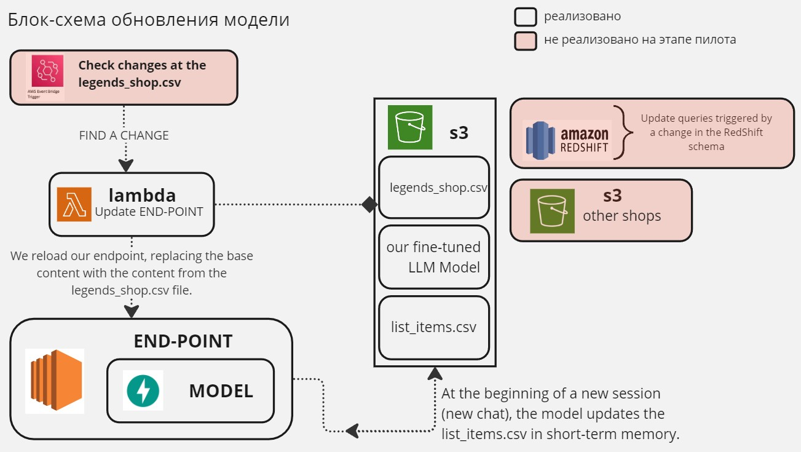
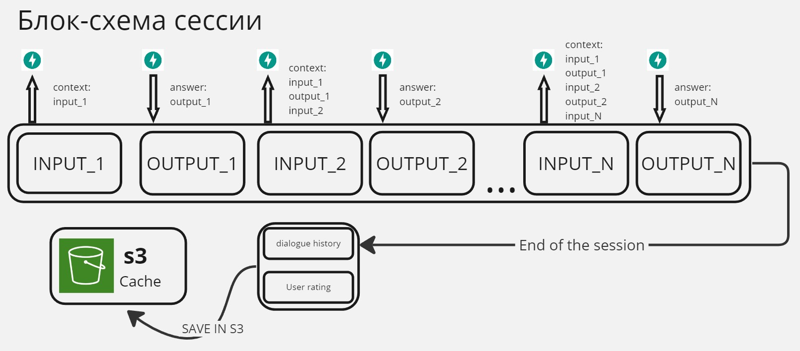
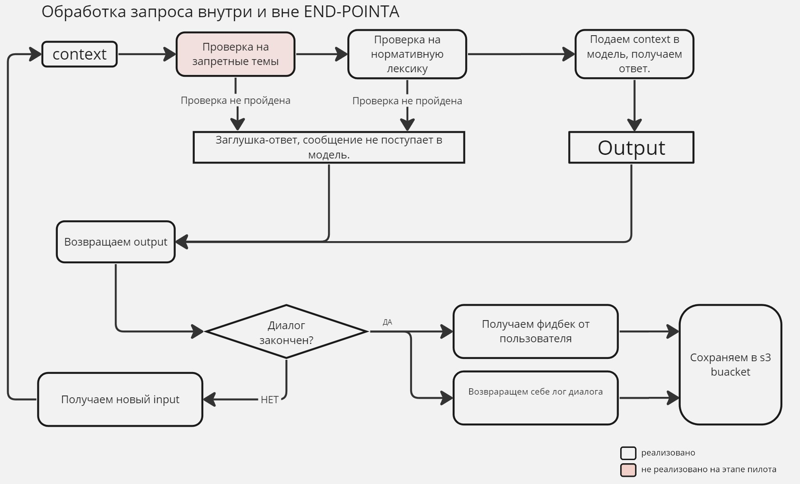

## 1.1 Обоснованность разработки продукта

- Базовая информация: Есть салон для продажи автомобилей марки Mercedes. У салона есть сайт. Информационный сервис
  работает не 24/7, а консультация пользователей нужна все время. Было принято решение создать онлайн помощника(Language
  Model Assistant) методом
  внедрения нейронных сетей.
- Бизнес цель: Уменьшение издержек на содержания штата, увеличение лояльности клиента, удержания потенциального клиента(
  посетителя)
- Побочные цели: Сервис поддержки клиентов не может работать круглосуточно. Обеспечить непрерывное взаимодействие с
  клиентами, которые обращаются в службу информационной поддержки, даже вне рабочего времени сервиса, устраняя ситуации,
  когда клиенты не получают своевременного ответа или перезвона со стороны сотрудников утром. Благодаря ассистенту
  Language Model Assistant клиент сможет задавать вопросы и получать на них ответы в любое время суток, при любой
  нагрузке
  на информационный сервис.

## Критерии успеха проекта:

1. **Увеличение метрик-показателей:**
    - а. *CSAT (Customer Satisfaction Score):* Увеличение уровня удовлетворенности клиентов после каждого взаимодействия
      со службой поддержки. (Поднятие средней оценки до значения не меньше 8)
    - б. *NPS (Net Promoter Score):* Повышение готовности клиента рекомендовать ваш продукт или услугу другим. (на 15%
      от среднего значения по кварталам прошлого года)

2. **Побочные критерии успеха:**
    - а. *Количество запросов/ответов помощнику. (Данную метрику сложно оценить в численных значениях. Для начала
      обусловим, чтобы уменьшилось кол-во заявок на "перезвон" в нерабочее время суток.)*
    - б. *Уменьшение средней продолжительности разговора на рабочую смену сотрудников поддержки. (10-20%, что позволит
      нам вписаться в базовый коэффициент 0.72 по занятости сотрудника на работе ("защита от burn-out"))*
    - в. *Увеличение времени сессии клиента в нашем веб-приложении/сайте. (Псевдо-цель, для возможного дополнительного
      заработка с помощью контекстной рекламы (контекстная реклама прямого направления - по типу, сети автосалонов,
      готовых установить пакеты AMG, BRABUS на автомобили))*

## 1.2.1 Бизнес требования и ограничения

** Бизнес требования **

- Клиент может вести диалог с ассистентом
- Бот может рассказать информацию об автосалоне
- Помощник может рассказать информацию о наличие автомобилей в салоне
- История диалога с ассистентом должна быть доступна для аналитики в течение 90 суток. (Примечание: кол-во суток, должна
  быть плавающая величина, с легкой возможностью её изменения)
- Создание скриптов, проверяющих запрос к модели по списку "запрещенных тем"
- Модель не должна общаться на тематики, не относящиеся к теме портала

** Доп бизнес требования **

- Бот может поддерживать интересные беседы про mercedes, на основе знаний из статей wikipedia

** Бизнес-ограничения **

- Имеется потребность в быстрой разработке продукта (компания готова финансировать жизненый цикл от идеи до введения в
  прод на 3-4 месяца.)
- Ограниченность в финансирование поддержки работы ассистента (Ограниченность в ресурсах, нет возможности работать с
  тяжелыми моделями требующими для инференса большой финансовой поддержки)
- Возможные ограничения в масштабируемости продукта из-за ограниченности ресурсов и сроков разработки.

# 1.2.2 Требования к инфаструктуре и нагрузки

Требования для работы сервиса:

1. Общая архитектура:
    - Сервис должен предоставлять API для обработки запросов.
    - Модель будет работать в режиме инференса на выделенном сервере (end-point).
    - Использование оборудования: видеокарта GPU 16GB, RAM 32GB, базовое ядро CPU.
2. Ответы и время ответа:
    - Клиент должен получить ответ не дольше чем за 10 секунд.
    - В случае высокой нагрузки, если обработка запроса займет более 10 секунд, пользователь должен увидеть
      alert-сообщение: "Ваш запрос обрабатывается, ожидайте ответа".
3. Производительность:
    - Модель должна быть спроектирована для максимальной нагрузки в 10 запросов в минуту.
4. Оборудование и ресурсы:
    - CPU: Базовое ядро, выделенное сервисом AWS.
    - RAM: Минимум 32GB.
    - GPU: Видеокарта с объемом памяти 16GB.
5. Управление высокой нагрузкой:
    - При высокой нагрузке должна быть реализована система предупреждений (alert-сообщений) для пользователей о задержке
      в обработке запроса.
6. Хранение и использование данных:
    - Пользователи должны быть ознакомлены с условиями сохранения информации и согласны на использование их запросов в
      дальнейшем.
7. Сетевая пропускная способность:
    - Сервис должен иметь достаточную сетевую пропускную способность для обработки 10 запросов в минуту.
8. Дополнительные ресурсы в случае высокой нагрузки:
    - Предусмотрена возможность масштабирования ресурсов (CPU, RAM, GPU) для обработки дополнительной нагрузки.
9. Мониторинг и оптимизация:
    - Реализован мониторинг производительности для оптимизации работы системы при необходимости.

Эти требования обеспечат стабильную и эффективную работу сервиса, учитывая аппаратные и программные особенности.

## 1.3 Что входит в скоуп проекта/итерации, что не входит

**Задачи текущей итерации:**

- Сбор и подготовка обучающих данных, включая разметку дополнительных данных
- Создание тестового набора вопрос/ответ для визуальной оценки качества работы моделей.
- Разработка и обучение модели машинного обучения.
- Интеграция модели в приложение или веб-сервис.
- Создание пользовательского интерфейса для "беседы" с виртуальным помощником.
- Тестирование приложения на предмет точности и производительности.

**Задачи, которые не входят в текущую итерацию:**

- Расширение функциональности общения (например построения графиков, таблиц, отображение изображений в диалоге).
- Оптимизация скорости модели для работы на мобильных устройствах.
- Разработка системы учета пользователей и их данных, для "вспоминания" истории беседы и продолжения работы с ней.

**Результат с точки зрения качества кода и воспроизводимости решения**

- Создание отдельного репозитория для кода приложения.
- Разработка модульной структуры приложения для упрощения сопровождения и расширения функциональности.

**Описание планируемого технического долга**

- Внедрение системы логирования для отслеживания работы приложения и обнаружения проблем.
- Разработка механизма авторизации пользователей для обеспечения безопасности данных и доступа к функциональности.

## 1.4. Предпосылки решения

**Данные:**
Данные взяты из базы данных нашего автомобильного салона (Квери на основе БД) и специальный шаблон-брошюра FAQ вопросами
о салоне

**Режим работы**
В режиме онлайна

**Гранулярность модели**
Модель способна вести диалоги со всеми пользователями параллельно. Каждый диалог является "уникальным"

**Процесс**
Мы считаем, что оптимальным решением будет написание саб-модуля. Данный модуль мы поднимаем как API через AWS, и
стучимся к нему и получаем необходимую для нас информацию

**Ошибки**
Очевидно, что модель будет ошибаться и давать некорректные ответы. Для этого мы и предпологаем хранить историю, для
дальнейшей возможности переобучения системы

**Зачем нужен сервис (пример использования):**

1. Улучшение опыта клиентов: Пользователи могут получить мгновенные ответы на свои вопросы, ознакомиться с
   характеристиками автомобилей и ознакомиться с актуальными предложениями без необходимости ожидания ответа от живого
   оператора.
2. Круглосуточная доступность: Онлайн-бот доступен 24/7, что позволяет клиентам общаться и исследовать предложения
   в удобное для них время, даже в нерабочие часы.
3. Быстрое предоставление информации: Бот способен моментально предоставить информацию о моделях, ценах, наличии
   автомобилей, а также оформлении покупки и финансовых вопросах.
4. Автоматизация повторяющихся задач: Бот способен выполнять рутинные задачи, такие как рассылка брошюр, расчет
   стоимости автомобиля или запись на тест-драйв, что экономит время и ресурсы персонала.
5. Снижение нагрузки на службу поддержки: Благодаря боту, часть вопросов и запросов клиентов может быть решена
   автоматически, что освобождает операторов для более сложных и специализированных задач.
6. Создание лояльности клиентов: Предоставление удобства и мгновенной помощи может укрепить связь с клиентами
   и повысить вероятность успешных продаж.
7. Сбор данных и аналитика: Бот может собирать информацию о предпочтениях клиентов,
   что помогает в анализе и улучшении предложений.

## 2. Методология Data Scientist

### 2.1 Постановка задачи

Создание диалоговой системы с кратковременной и долговременной памятью, умеющей анализировать шаблоный и табличный
контекст (prompt).

** Логика работы модуля: **

- Пользователь заходит на сайт и в правом углу всплывает окно с нашим онлайн-собеседником
- Если в данный момент рабочее время суток, у пользователя есть выбор: либо оставить номер, для связи с ним в короткое
  время, либо задать вопрос виртуальному помощнику. В нерабочие часы существует возможность только задать вопрос онлайн
  помощнику.
- Клиент задает вопрос, и получает ответ.
- Клиент может вести диалог с ассистентом.
- После окончания диалога клиенту предлагается оценить работу ассистента, "лог" с диалогом отправляется в базу данных
  для хранения.

### 2.2 Блок-схема

### 2.3 Этапы решения задачи

### 2.3.0 Выбор метрик (ML)

Так как задача специфичная, классические метрик для задач классификации и регрессии не подойдут.

- На train стадии, мы будем использовать метрики "схожести" - BLEU Score. Благодаря этим метрикам мы будем оценивать
  ответы,
  полученные от нашего алгоритма с ответами из нашей разметки данных. Так же при проведении экспериментов будем
  учитывать время отклика модели, так как скорость нам тоже необходима. Для оценки ответов по табличным данным,
  будем использовать метрики точности (кастомные RMSE и Accuracy)
- На инференсе стадии, или стадии A/B мы будем учитывать значения "User Satisfaction" (Оценки
  пользователей после завершения диалога.)

**Расчёт BLUE-коэффициента:**
, где

**Примечания:**

- При расчёте использовать N-gramm размером до 4 слов.
- Для коэффициента `coeff_bc` использовать \(\text{th}\) в виде среднего значения длины строки по ответам из
  тренировочной разметки данных.
- Как расчитывается метрика BLUE? Мы подаем промпт на вход нашей модели, получаем ее output. Берем ответ с разметки
  даты, и находим значение коэффициента BLUE. Проделываем данную операцию для каждой из строк. Далее усредняем значения
  коэффициента

### 2.3.1 Этап подготовки данных

Сбор данных: Для создания корпуса необходимо:

- выпарсить данные из открытых источников (например Wikipedia). Использовать рекурсивный подход поиска статьи по
  ключевым словам, таким как "Mercedes", "мерседес". Для закрытой внутренней версии продукта также необходимо создать
  корпус из внутренних данных по моделям и их комплектациям. Необходимо выпарсить форум Q/A с вопросами по машинам марки
  Mercedes. Все данные можно посмотреть по расположение dev/corpus
  Результат собранного датасета:
  

- Собрать некоторую "легенду салона", которая будет подаваться в дальнейшем как context.
  Результат собранного датасета:
  
- Прописать job, которая собирает из внутренней базы query(витрину) с available_product (С автомобилями которые
  доступны для покупки пользователю). Зафиксировать данную версию query для обучения модели. (Предусмотреть возможность
  обновления данной квери в бакете по расписанию (В проде модель должна будет видеть только актуальную квери на каждом
  этапе).
  Результат собранного датасета:
  

MVP: csv файлы. В каждом датафрейме есть 3 колонки - url, context, status. (url - страница, с которой парсилась
информация, context - текст с данной страницы, status - статус об операции с данной страницы.)
Возможные значения статусов: "Error" - с данной странице информацию получить не получилось, произошла ошибка,
"No find special words" - на данной странице нет ключевых слов (Таких, как mercedes, мерседес и т.д.), и "Ok" - данная
страница была успешно обработана и на ней есть ключевые слова. Для Q/A форума необходимо создать аналогичный корпус.

### 2.3.2 Этап препроцессинга:

- Очистка данных. необходимо просмотреть корпус данных, почистить данные от символов разметки страниц и "мусорных"
  значений после парсинга.
- Создать "тестовый" набор вопрос, на котором мы будем оценивать качество работы моделей.
  (Пример вопроса: 'Чем mercedes cls класса отличается от e класса?', "Доступен ли тест-драйв в вашем салоне?",
  "Есть ли сейчас в наличие c180"?)
- Написания вопросов по "легенде салона". По квери салона на доступность тех или иных автомобилей.

MVP: Проверка данных. Создания из них двух типов корпусов - первый, когда в каждой статье из вики присутсвуют ключевые
слова и второй, которой создается из всех статей, скаченных рекурсионным подходом. Создать тестовый набор - должна быть
создана csv таблица содержащая две фичи - вопрос ответ. Основная часть вопросов должна быть создана на основе
современных материалов 2022-2023 года.

### 2.3.3 Этап создания baseline

- Рассмотреть LLM модели, доступные нам на русском языке
- Провести "тест-драйв" данных моделей
- Тонкая настройка: выбрать более удачные архитектуры (визуальная корреляция качества ответа и скорости работы) и
  и дообучить данные модели на нашем корпусе. (Использовать методы LoRa и др.)

MVP: notebook тетради, или логи с обучением/тестирования базовых моделей. По результатам должен быть выполнен отчёт.
Дообучение моделей. По возможности ресурсов допускается файнтюнинг не всех слоев модели, а только "головы". После
фаинтюнинга модель должна быть оценена по loss-потерям.

### 2.3.4 Этап оценки:

- Валидация: В процессе обучения проводить валидацию модели на тестовой выборке вопросов. Должен быть подготовлен
  pipeline-notebook, в котором при замене типа модели, все ячейки выполняются в дальнейшем автоматически и сохраняют
  результаты. При наличии свободных ресурсов допускается выполнение cross-validation.

- Тестирование: По завершении обучения модель тестируется людьми, на качество вопросов. Модель тестируется на наличие
  "закрывающих" функций, на вопросы, на которые модель не должна отвечать. (Вопросы не касающиеся товаров марки
  mercedes)

MVP: Должны быть подготовлены ноутбуки с оценками качества моделей. Ответы модели на вопросы должны быть оценены
тестировочной группой по 5-бальной шкале. Где 5 - наилучший ответ модели, 0 - ответ модели совершенно неясен. В идеале
модель работает с тестовой средой с заявленным качеством согласно бизнес-требованиям.

### 2.3.5 Интеграция в модель правил:

- Деплоин, развертка скриптов ограничивающих возможности ответа модели (см пункт 1.2.1) (Список запрещенных тем
  согласовывается с заказчиком. Заказчик имеет право изменять список как угодно на любой стадии
  разработки проекта)

MVP: Наличие скриптов и правил, для первичной фильтрации запроса. Если запрос имеет "стоп-слова", или система
фильтрации не пропускает данный вопрос, ответом должно быть сообщение-заглушка.

### 2.3.6 Контрольная проверка качества моделей на мощностях инференса модели

- Проверка качества модели, и ее скорости. Допускается оптимизация модели путем квантования с возможностью потери
  в качестве (допускается уменьшение значения метрики BLEU на 10%).
- Проверка соответствия с требованием заказчика. Дополнительное согласование, если требования различны.
  MVP: Составлен список требований для модели. При выполнении оптимизации модели, необходима дополнительная проверка
  качества модели.

## 3. Подготовка пилота проекта

### 3.1. Способ оценки пилота

- Все авторизованные пользователи получают рассылку с акционным предложением, о появление онлайн помощника с акцией о
  прохождение тестирования и услугой в подарок (вулканизация или мойка автомобиля) - смотрим оценки пользователей нашего
  ассистента
- Смотрим метрики по юзерам, которые пришли к нам на сайт, и использовали нашего ассистента для получения информации
- Оцениваем устойчивость к стресс-нагрузки (время ответа на одновременно отправленные 50 паралельных запросов)
- Определяем с бизнесом, будут ли акционные предложения, если информация была получена через ассистент-помощника на
  сайте
- После введения тестирования, проверяем качество ответов ассистента.
  Во время проведения пилота:
- Собираем данные, форматируем к "диалоговой разметки" для дальнейшего обучения
- Паралельный запуск (запросы, которые приходят в службу поддержки, отправляем в ассистента, смотрим качество ответов)
- Монитором нагрузку модели.

### 3.2. Что считается успешным пилотом

Мы можем считать пилот успешным при выполнении следующих условий:

- Время общения с ботом, является статистически значимой величиной
- Мы получаем положительный фидбек от пользователей
- Значение NPS метрики является значимой величиной.
- Нагрузка на наш call-центр значительно снизилась (Уменьшение среднее время разговор операторов за смену и уменьшение
  заявок на перезвон в рабочее время)
- "Качество" ответов на запросы пользователей сопоставима с качеством ответов работников службы поддержки

## 4. Внедрение

### 4.1 Архитектура решения

Архитекутура решения было сложно описать одной блок-схемой, поэтому было принято решение использовать сразу несколько
блок схем.

- Блок-схема для понимания, обновления end-point с моделью
  
- Блок-схема "сессии" пользователя с ассистентом.
  
- Блок-схема логики обработки запроса внутри END-POINTA
  

### 4.2 Описание инфраструктуры и масштабируемостиэ

- Наша модель очень доступна для масштабирования внутри нашей компании. На данный момент пилотный проект разрабатывается
  тольк для одного автосалона. В дальнейшем, мы можем легко масштабировать нашу модель, просто подсовывая ей в
  контекст (промт) другую дату.
- Наша модель не будет испытывать огромную нагрузку. Если будет большая нагрузка, то AWS EC2 позволяет масштабировать
  вычислительные ресурсы в соответствии с потребностями модели, обеспечивая гибкость в управлении нагрузкой.

### 4.3. Мониторинг

Для мониторинга модели мы можем использовать следующие ресурсы:

- CloudWatch: Используйте AWS CloudWatch для мониторинга использования ресурсов (например, CPU, память), а также для
  отслеживания метрик работы и логов приложений.
- S3 Logging: Храните и анализируйте логи в S3 для долгосрочного анализа производительности и поведения модели.
- AWS CloudTrail: Для аудита и мониторинга действий пользователей и API, взаимодействующих с вашими ресурсами AWS.
    - Критические нагрузки:
      Когда модель LLM, размещённая на AWS EC2, достигает установленных пределов критических метрик, вступает в действие
      заранее настроенная система управления производительностью и безопасности. Эта система, реагируя на превышение
      пороговых
      значений, автоматически отключает модель, чтобы предотвратить потенциальные проблемы, связанные с перегрузкой или
      ухудшением качества обслуживания. В этот момент генерируется сигнал тревоги, который моментально направляется
      технической команде.

    - Получив оповещение, техническая команда быстро приступает к работе, чтобы выяснить и устранить причины, приведшие
      к
      превышению метрик. Этот процесс включает в себя детальный анализ системных логов, мониторинг текущих метрик и
      пересмотр
      конфигураций. Если в ходе диагностики обнаруживаются конкретные неполадки, такие как неправильное распределение
      ресурсов
      или ошибки в программном коде, команда оперативно исправляет эти проблемы.

    - По завершении всех необходимых корректировок и проведения всесторонних тестов для обеспечения стабильности и
      надёжности
      системы, модель LLM снова запускается. Весь этот процесс сопровождается строгим мониторингом, чтобы избежать
      повторения
      подобных инцидентов в будущем. Таким образом, техническая команда гарантирует непрерывную и эффективную работу
      модели,
      поддерживая высокие стандарты обслуживания и производительности.

### 4.4. Требования к работе системы

Пропускная способность и задержка обеспечивается структурой и возможностью масштабирования.

### 4.5. Безопасность системы

Ограничение в возможностях AIM-ролей, выданных пользователям. Удобство работа end-point, что невозможно выйти за его
пределы и его способность выполнять только опредленные инструкции. Специальные типы шифрованния данных в AWS структуре.
Доступ к EC2 только через VPC и VPN - "изоляция ресурсов" из вне.

### 4.6. Безопасность данных

В рамках нашего проекта, особое внимание уделяется обеспечению безопасности данных, хранящихся в Amazon S3 бакетах.
Доступ к бакетам из вне недоступен, есть ограничения по действиям с бакетами для отдельных ролей (Политика
ReadOnlyAccess и S3All)

### 4.7. Издержки

- Для разработки проекта необходима команда из 3 ML Engineer на период создания MVP
- Необходимы вложения создания и настройки необходимой инфраструктуры на AWS
- Оплата инфстрактуры AWS (плавающая величина, зависит от кол-ва взаимодействий пользователей с моделью)

### 4.8. Риски проекта

- Некорректные ответы ассистента, приводящие к потере клиента (Например - Неверные ответы о наличие автомобиля)
- Технические сбои модели
- Пустая трата токенов модели (Оплачиваем бесполезные запросы к модели)
- Непопулярность модели среди пользователей
- Фродовые риски - при общении с ассистентом пользователей может передать свои личные данные. При некачественной
  обработки данных из логов, личные данные могут попасть в тренеровочный корпус для контекста в дальнейшем. 